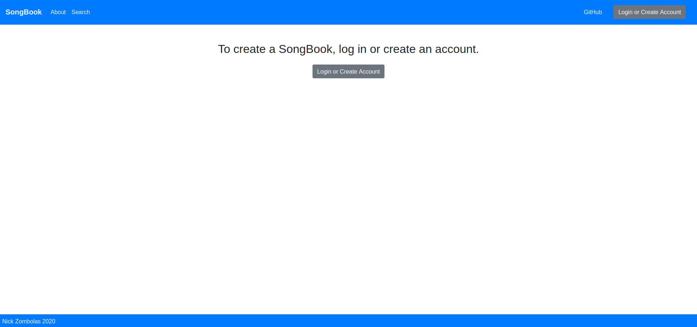
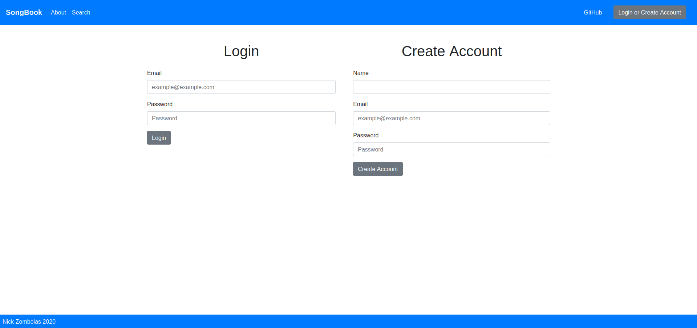
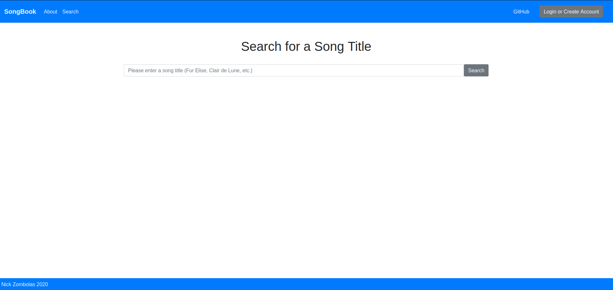
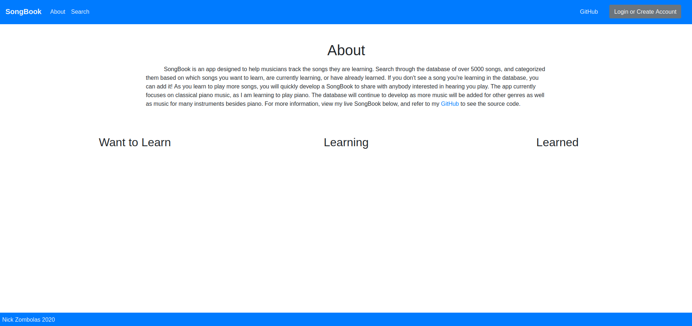

# SongBook
  SongBook is an app designed to help musicians track the songs they are learning. Search through the database of over 5000 songs, and categorized them based on which songs you want to learn, are currently learning, or have already learned. If you don't see a song you're learning in the database, you can add it! As you learn to play more songs, you will quickly develop a SongBook to share with anybody interested in hearing you play. The app currently focuses on classical piano music, as I am learning piano. The database will continue to develop as more music will be added for other genres as well as music for many instruments besides piano. 

Try the app here:

Note: As of July 2022, the database is no longer active. Some features may not work as expected.

Note: SongBook is no longer in development. 

~~https://floating-everglades-95969.herokuapp.com/~~

# Tech Used / Motivation
The app is written using the MERN stack (MongoDB, Express, React, Node.js), with frontend state management implemented with Redux.
The goal was to learn how to build and maintain a database with MongoDB, and build a web application to interface with it.
As I am more interested in backend development, the focus of the project was more about designing the server and database rather than frontend styling.

To interact with the database, a user must make an account. On account creation, a token (JSON Web Token) is created for user authentication,
and the user's information is stored in the database. Password hashing is done using bcrypt. Once logged in, the user can access protected routes such as querying the database.
The user can add as many songs as they like to their three lists: "Want to Learn", "Learning", or "Learned". Users can promote these songs to the "Learned" section as they practice and get better, developing a list of songs they can share with anybody interested in hearing them play.

# Screenshots

### Landing Page

### Login or Signup

### Search the Database

### About Page with Empty Songbook
Unfortunately the database is no longer active, so my live learning isn't visible

# Installation

Note: Installation will not work going forward as this project is no longer maintained.

Make sure to have the following installed:
- Node.js v10.20.1
- React v16.13.1

You can clone the repo to your machine with: https://github.com/nickzombolas/SongBook.git

In the project root, run `npm install`. Once all dependencies are installed you are ready to launch the app!

To run the client: `npm run client`.

To run the server: `npm run server`.

To run the whole app: `npm run dev`.
